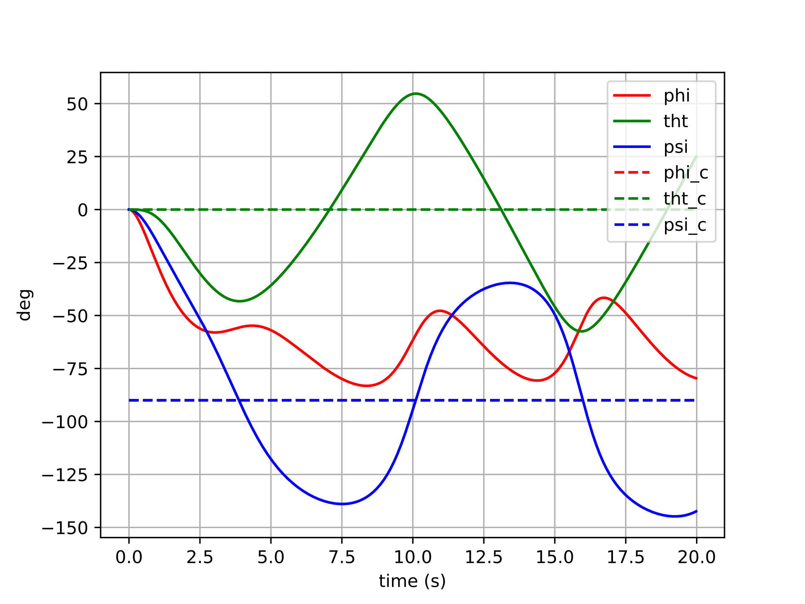

***Project description in progress...***

## Motivation

## Spacecraft Model

## Controlling the Spacecraft

### Controller Types

### Results

{::nomarkdown}

    

        <h4>Controller with Euler Error</h4>

        $$\boldsymbol{u}=-k_q\left(\begin{bmatrix}\phi-\phi_d && \theta-\theta_d && \psi-\psi_d\end{bmatrix}^{\top}\right)+\dots$$

        

        
        

        

        
        

        

        
        

        

        
        

        

        
        

        

        
        

    

    

        <h4>Controller with Tangent Space Error</h4>
        <!--$$\boldsymbol{u}=-k_q(\boldsymbol{q}\ominus\boldsymbol{q}_d)-k_{\omega}\left(\boldsymbol{\omega}-\boldsymbol{R}^{\top}\boldsymbol{R}_d\boldsymbol{\omega}_d\right)+\boldsymbol{\omega}\times\boldsymbol{J}\boldsymbol{\omega}+\dots$$-->

        $$\boldsymbol{u}=-k_q(\boldsymbol{q}\ominus\boldsymbol{q}_d)+\dots$$

        

        
        

        

        
        

        

        
        

        

        
        

        

        
        

        

        
        

    

{:/}

## Conclusions

